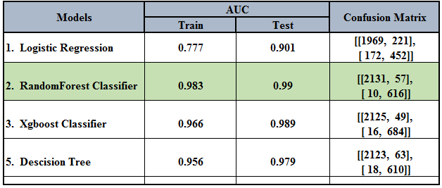

# employee_retention

*Our client is the HR department at a large software company and the idea is to use data to predict whether an employee is likely to leave or not*

###  Problem Statement
* The HR department has hired us as data science consultants. They want to supplement their exit interviews with a more proactive approach.
* They've asked their business intelligence analysts to provide us a dataset of past employees and their status (still employed or already left).

It is a binary classification task, where given a set of features we need to predict whether the employee is likely to leave or not.

#### Output -

